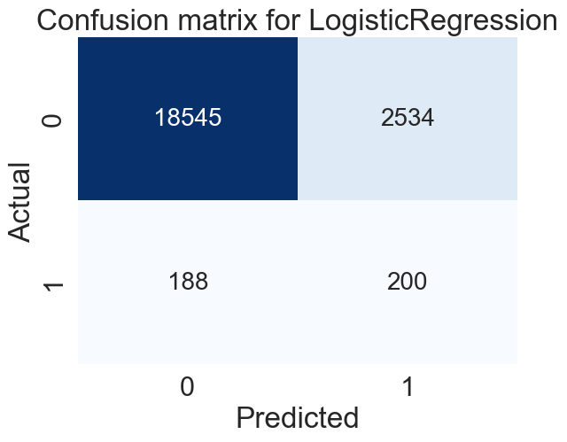
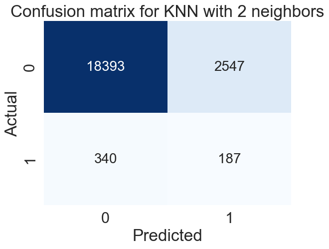
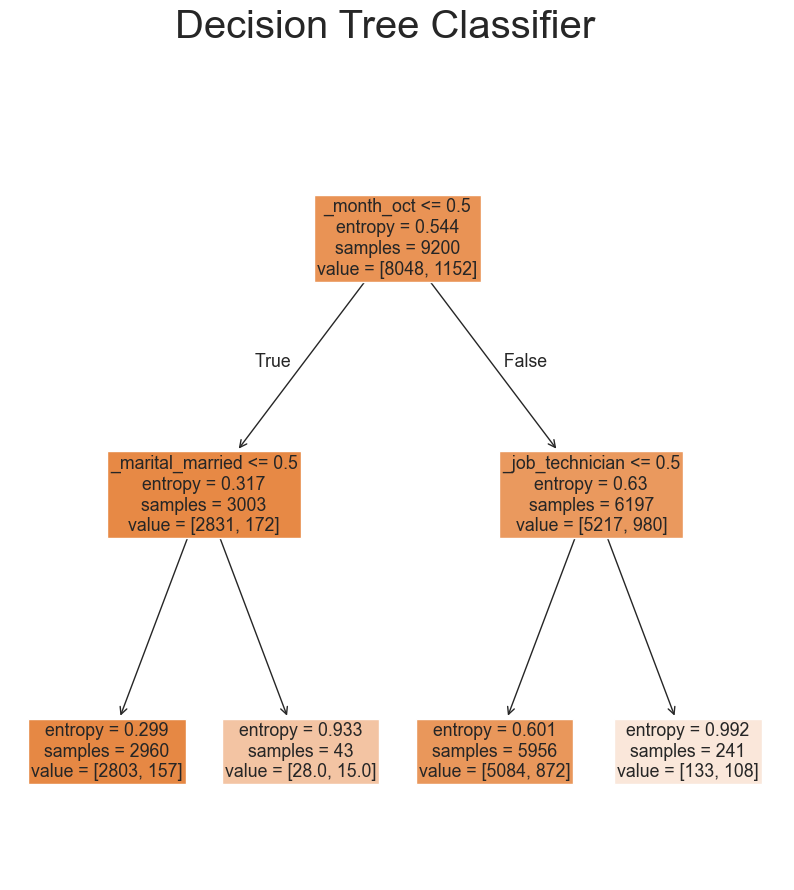
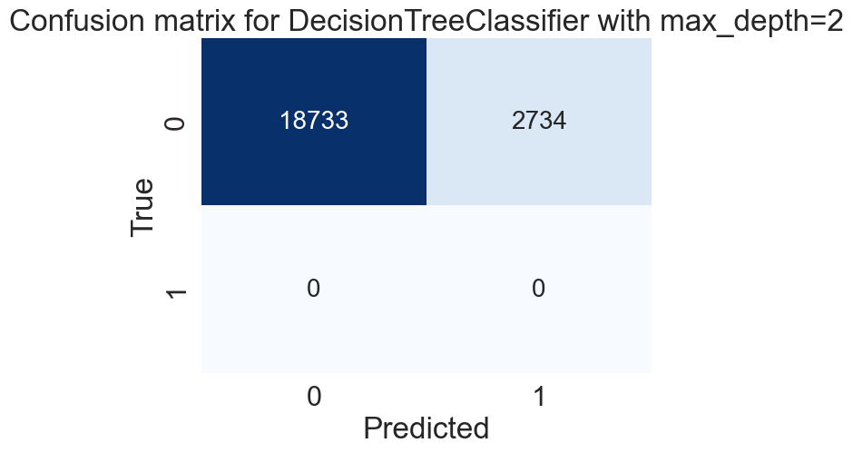
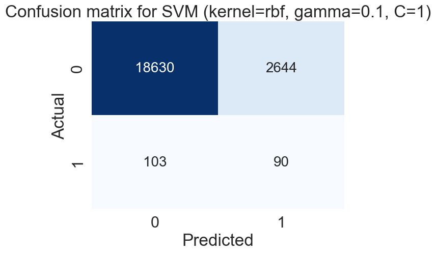
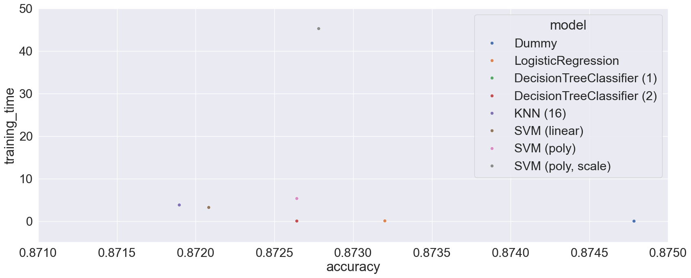

# Assignment 17.1: Comparing Classifiers

## Problem Statement
The goal of the task is to predict the success of the marketing campaign (feature 'y') using data gathered/available _prior_ to the call. Compare various models to the baseline to determine which models are the most accurate; explain findings.

## Summary of Findings
The following features were generated from the provided data:
* client information (age, job, marital status, education, default, housing, and loan)
* last campaign (contact, month, day of week, and duration)
25% of the customers were filtered out due to invalid data. 

Here are the results from each of the models used during training.

### Dummy Model
This was used to create the baseline. 

### Logistic Regression
This was configured using `solver=liblinear`. The confusion matrix is listed below. 

### K Nearest Neighbors
This was configured with hyperparameter `n_neighbors=2`. 

### Decision Tree Classifier
This was configured with hyperparameter `max_depth=2` . 

### Support Vector Machine
This was configured with hyperparameter `C=1`, `gamma=0.1`, and `kernel=rbf`. 

Using a 30/70 training/test split of the data, each of the models was validated using test accuracy. The results are seen below. 

| Model | Features | Train Time | Train Accuracy | Test Accuracy |
| ----- | -------- | ---------- | -------------  | -----------   |
| Dummy | 0 | 0.0067 secs | 0.872642 | 0.874783 |
| LogisticRegression | 10 | 0.0711 secs | 0.877174 | 0.873201 |
| DecisionTreeClassifier, max_depth=1 | 10 | 0.0588 secs | 0.874783 | 0.872642 |
| DecisionTreeClassifier, max_depth=2 | 10 | 0.0328 secs | 0.874783 | 0.872642 |
| KNN with 16 neighbors | 10 | 3.8013 secs | 0.877826 | 0.871896 |
| SVM (kernel=linear) | 10 | 3.2228 secs | 0.875217 | 0.872083 |
| SVM (kernel=poly) | 10 | 5.3204 secs | 0.874783 | 0.872642 |
| SVM (kernel=poly, gamma=scale, coef0=1, degree=8) | 10 | 45.2492 secs | 0.878478 | 0.872781 |

Based on these findings, I would recommend using the LogisticRegression model but I suspect SVM would yield a more accurate model with more development time.

## Developer Notes
The notebook is available (banking.ipynb)[here].

## Next Steps and Recommendations
Here are some recommendations for future research:
* More analysis with SVM - my initial run took 10 hours only afterwhich I realized my parameter choices were suboptimal. I suspect more trial and error with poly and other features would yield a more competitive model. From a runtime perspective, for the capstone project I can look at targeted usage of larger EC2 instances.
* Try KNeighborsRegressor
* Try Logistic Regression with polynomials and regularization
* Analyze model accuracy to look at using models on subsets of data rather than the whole dataset
* Consider using some of the data from the previous campaigns
* Use Stochastic Gradient Descent - didn't get a chance to use this
* More visualizations and better libraries for decision tree (ran into issue with anaconda)
* Now that I'm looking at the confusion matrix for decision tree, it's 